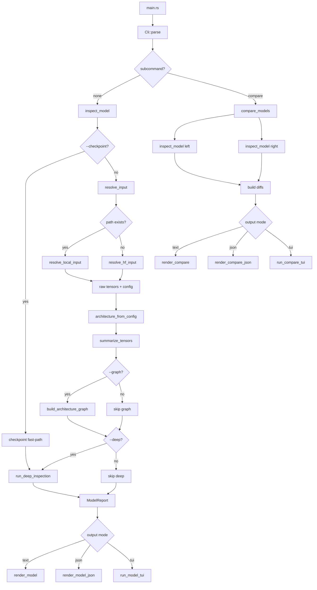
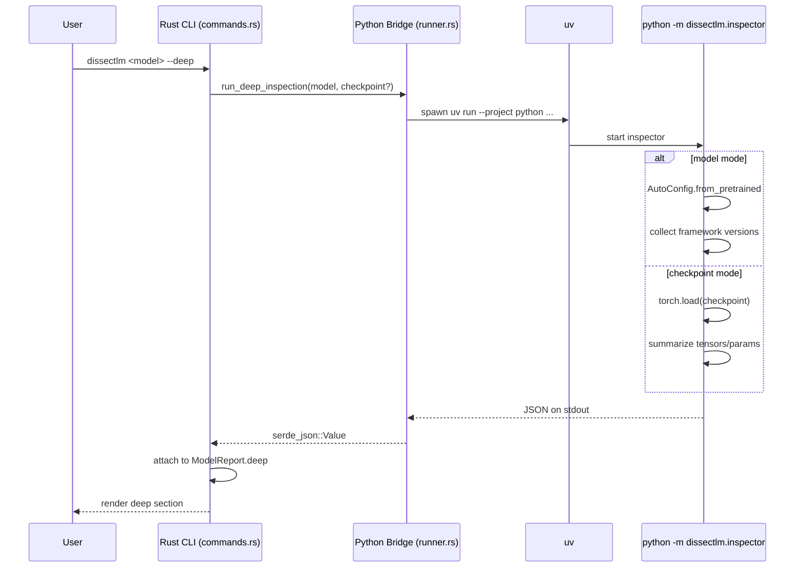

# DissectLM Architecture

## Project Purpose

`dissectlm` is a Rust CLI for model introspection with two modes:

- Fast metadata mode (default): reads `config.json` and `.safetensors` headers only.
- Deep inspection mode (`--deep`): delegates to Python for runtime-level introspection.

Primary goals:

- Avoid loading full model weights in normal usage.
- Give architecture + parameter distribution quickly.
- Provide multiple output modes (text, JSON, TUI).

## General Flow 

 

## Deep Flow Diagram (Mermaid)

## Feature Review (Detailed)

### 5.1 Base Inspect (`dissectlm <model>`)

What it does:

- Resolves local vs HF source.
- Reads config + tensor metadata.
- Outputs architecture and param distribution.

Key outputs:

- Model/source summary
- Total params
- Category percentage breakdown
- Architecture inferred fields
- Full raw config keys under `cfg.<key>`

### 5.2 `--params`

Adds:

- Top tensors ranked by param count (up to renderer-defined limit).

When useful:

- Identify largest parameter contributors quickly.

### 5.3 `--graph`

Adds:

- High-level architecture graph section.

How graph is formed:

- Uses inferred model type + layer count.
- Applies coarse block pattern from graph layer map.

### 5.4 `--attention-breakdown`

Adds:

- Q/K/V/O projection parameter totals.

How values are computed:

- Tensor name matching in `param_counter.rs`.
- Aggregated from all matched tensors.

### 5.5 `compare <model1> <model2>`

Runs two independent inspect pipelines, then computes differences for:

- Layers
- Hidden size
- Heads / KV heads
- Attention type
- Total params
- Category percentage metrics

### 5.6 `--json`

Switches renderer from human-focused output to machine-readable JSON.

Use cases:

- CI checks
- dashboard ingestion
- scripted comparisons

### 5.7 `--tui`

Switches renderer to interactive terminal UI.

Behavior:

- If stdout is TTY -> opens ratatui app.
- If not TTY -> logs fallback warning and prints text report.

### 5.8 `--deep`

Purpose:

- Inspect beyond metadata-only flow.
- Access framework-level details and raw checkpoint inspection.

Behavior:

- Rust process spawns Python inspector via `uv`.
- Appends Python JSON result into report under deep section.

Failure handling:

- If `uv`/deps are missing, returns explicit install hint.

### 5.9 `--checkpoint <PATH>` (requires `--deep`)

Purpose:

- Inspect a specific local checkpoint directly (`.pt`, `.bin`, `.ckpt`, etc.).

Behavior:

- Checkpoint mode bypasses metadata resolution (`resolve_input`), so it does not call Hugging Face APIs or local safetensors header parsing.
- Rust builds a deep-only `ModelReport` shell and runs Python bridge with `--checkpoint <PATH>`.
- Python path uses `torch.load`.
- Extracts tensor-level summary even if metadata-only path cannot parse the file.